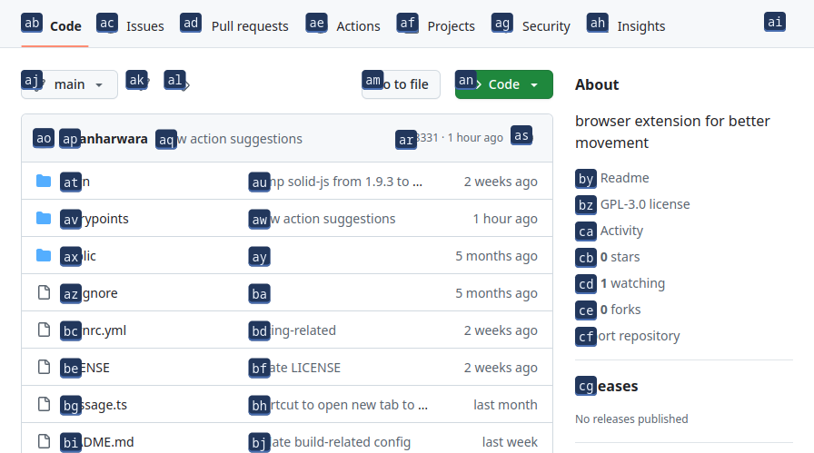
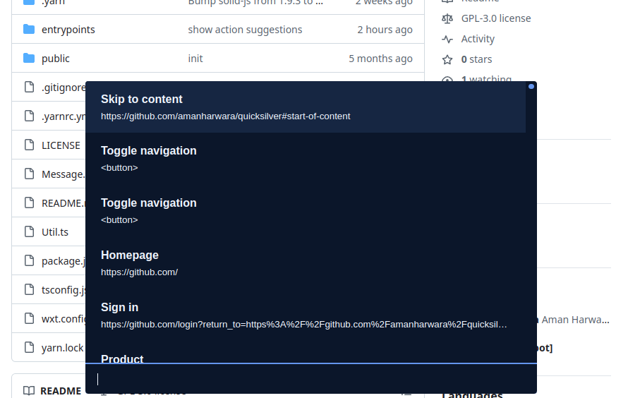
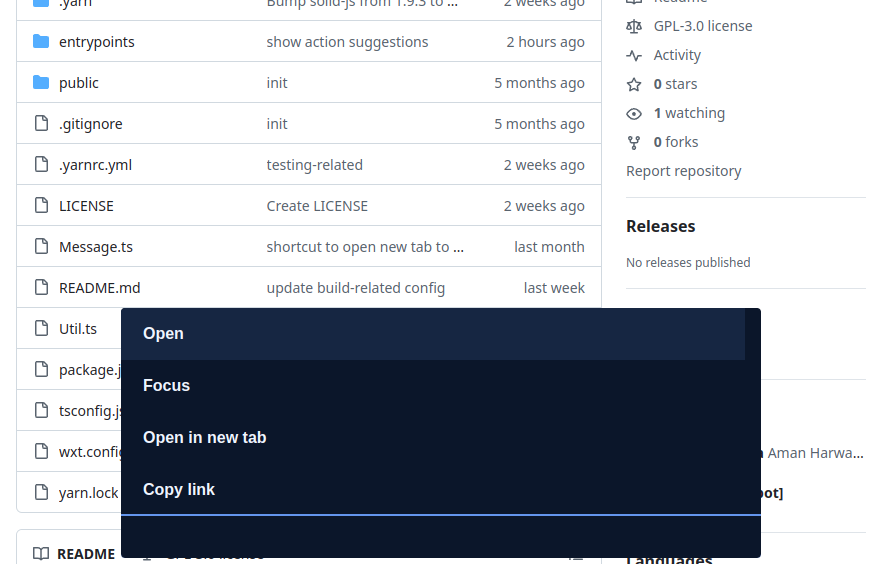
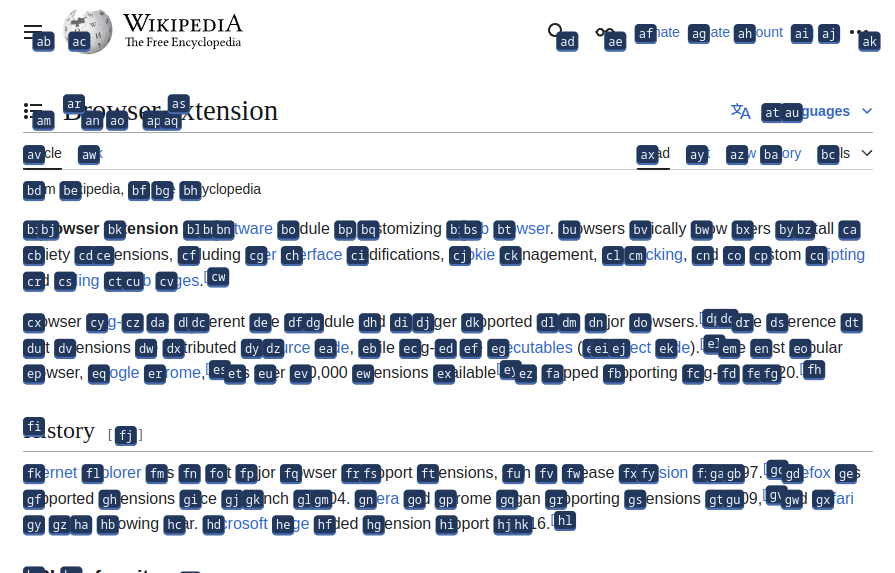
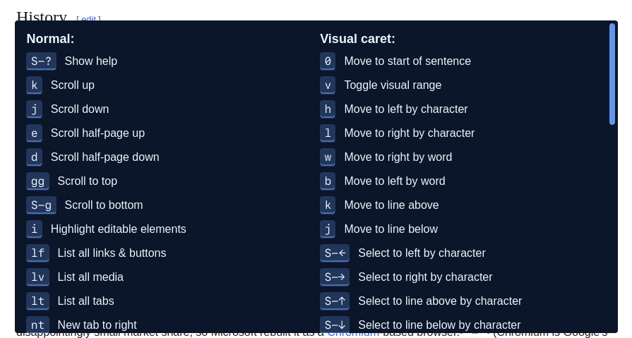

# quicksilver

Browser extension for better movement using the keyboard.

## Development

```console
yarn dev
```

Starts a new temporary chromium/chrome instance with the extension loaded and the wikipedia homepage opened. Pass `-b firefox` to start a firefox instance instead.

## Building

### Firefox

```console
yarn zip:firefox
```

### Chrome

```console
yarn zip:chrome
```

## Features

### Highlight interactive elements

Press <kbd>f</kbd> to highlight all the interactive elements visible on the screen, and then the key combination to interact with them.



### Search list of interactive elements

Press <kbd>lf</kbd> to list all the interactive elements in the document. Start typing to search, press <kbd>Enter</kbd> to select.





### Scrolling

Use the following commands to scroll the active scroll container:

<kbd>k</kbd> Scroll up by 70px

<kbd>j</kbd> Scroll down by 70px

<kbd>e</kbd> Scroll up by half page

<kbd>d</kbd> Scroll down by half page

<kbd>gg</kbd> Scroll to top

<kbd>S-g</kbd> Scroll to bottom

### Visual mode

Press <kbd>v</kbd> to highlight all the words visible on the screen and enter visual caret mode.



#### Visual caret mode

Visual caret mode allows moving the selection caret using certain vim motions like <kbd>h</kbd>, <kbd>l</kbd>, <kbd>w</kbd>, <kbd>b</kbd>, etc.


#### Visual range mode

Visual range mode allows extending the selection caret using certain vim motions like <kbd>h</kbd>, <kbd>l</kbd>, <kbd>w</kbd>, <kbd>b</kbd>, etc.


### Others

Press <kbd>S-?</kbd> to show all possible keyboard shortcuts.


